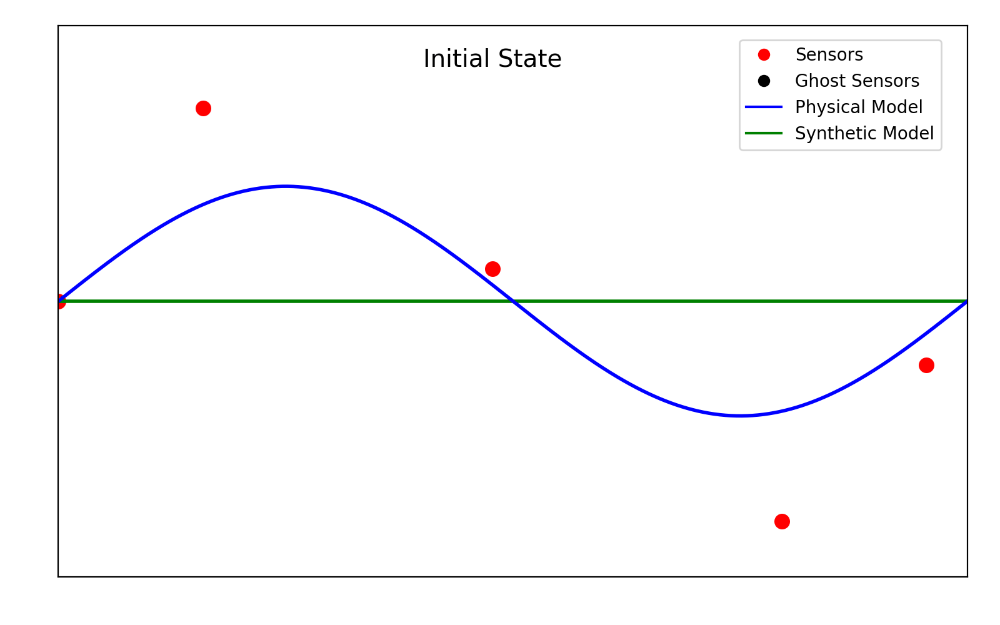

# HYCO: Hybrid-Cooperative PDE Modelling

This repository accompanies the paper [*HYCO: A Formalism for Hybrid-Cooperative PDE Modelling*](https://arxiv.org/abs/2602.23859).
It provides JAX implementations of Hybrid-Cooperative Learning (HYCO) for inverse and reconstruction problems governed 
by partial differential equations. HYCO trains a physics-based model and a data-driven neural model as cooperating peers, 
allowing them to recover solution fields and unknown physical parameters from sparse observations.



## Motivation

Physics-based models encode known governing laws and have interpretable parameters, but they can struggle when 
parameters are uncertain and observations are sparse. Data-driven models can fit complex data, but may need more 
observations and can extrapolate poorly beyond the training domain.

Many hybrid approaches make a neural model satisfy physics through an additional loss term. HYCO instead preserves 
two independent models: one physical and one synthetic. They learn their own objectives while being encouraged to agree 
across the domain. This symmetric formulation avoids treating either component as subordinate and gives both models 
a source of regularization.

## Approach implemented

HYCO couples a parameterized PDE solver and a neural network through an interaction loss that measures the discrepancy 
between their predicted solution fields. Each model may also use its own data-fitting loss. Training alternates between 
updating the physical parameters and the neural-network parameters, which admits a game-theoretic interpretation as 
seeking a Nash equilibrium between two cooperating agents.

The interaction loss is estimated at randomly sampled *ghost points*: auxiliary locations that are not part of the 
observation set. This reduces dependence on the physical discretization mesh and makes agreement enforcement practical 
for sparse or irregular data.

The supplied experiments use finite-element/physics-based and neural models for static two-dimensional Helmholtz and 
Poisson problems. They compare HYCO with a physics-only model and a physics-informed neural network (PINN), evaluating 
solution reconstruction and recovery of unknown coefficient parameters. The associated paper also demonstrates the 
framework on a time-dependent Gray–Scott reaction–diffusion system, where HYCO improves reconstruction and parameter 
identification under sparse data.

## Repository contents

| File or directory | Purpose |
| --- | --- |
| `src/Experiment_1_new.py` | Helmholtz reconstruction with observations restricted to a subdomain; compares HYCO, physics-only, and PINN training. |
| `src/experiment_baseline.py` | Baseline Helmholtz experiment with observations across the domain. |
| `src/experiment_2.py` | Helmholtz reconstruction experiment using saved or newly trained HYCO outputs. |
| `src/poisson_1.py` | Poisson-equation HYCO reconstruction and parameter-identification experiment. |
| `src/models/` | Physics-based, synthetic neural, and PINN model definitions. |
| `src/tools/` | Finite-element, training, plotting, symbolic, and animation utilities. |
| `src/files/` | Saved histories, parameters, model checkpoints, and numerical outputs. |
| `src/results/` | Saved comparison figures and animations. |
| `src/examples/` | Minimal examples for training the physical and synthetic models separately. |

## Requirements

Use Python 3.10 or newer. The core dependencies are JAX, Flax, Optax, Optimistix, Orbax, NumPy, and Matplotlib:

```bash
pip install "jax[cpu]" flax optax optimistix orbax-checkpoint numpy matplotlib
```

For the optional GIF and symbolic utilities, install Pillow and SymPy:

```bash
pip install pillow sympy
```

For GPU execution, install the JAX build appropriate for the local CUDA environment following the [official JAX installation instructions](https://docs.jax.dev/en/latest/installation.html).

## Running the simulations

Run the scripts from the repository root. Set `PYTHONPATH=src` so the model and tool modules can be imported:

```bash
PYTHONPATH=src python src/Experiment_1_new.py
PYTHONPATH=src python src/experiment_baseline.py
PYTHONPATH=src python src/experiment_2.py
PYTHONPATH=src python src/poisson_1.py
```

The baseline and Experiment 1 scripts prompt whether to retrain the models. Enter `y` to generate new results, 
or `n` to load the saved arrays and generate the supplied visualizations. The other experiments similarly prompt before 
training and can restore their saved checkpoints. Training runs use 3,000 epochs by default; adjust the `epochs` setting 
near each script’s entry point for shorter exploratory runs.

## Reference

L. Liverani and E. Zuazua, *HYCO: A Formalism for Hybrid-Cooperative PDE Modelling*, 2026. 
The manuscript is available on  [arXiv:2602.23859](https://arxiv.org/abs/2602.23859). 

## Funding

This project has received funding from the European Research Council (ERC) under the European Union's Horizon 2030 
research and innovation programme (grant agreement No. 101096251, CoDeFeL).
